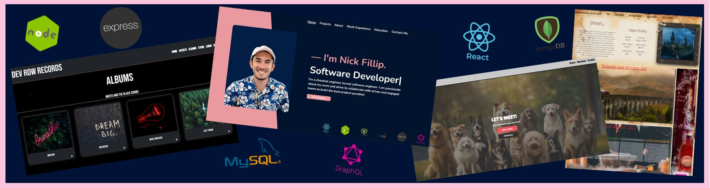

### Hi there I'm Nick, Let's connect! :wave: 


```js
import SoftwareDeveloper from 'nick-fillip';

class Bio extends SoftwareDeveloper {
    this.name = 'Nick Fillip';
    this.title = 'Full Stack Engineer';
    this.company = 'undefined';
    this.location = 'Colorado';
}

class Skills extends SoftwareDeveloper {
    this.languages = ['JavaScript', 'CSS', 'HTML'];
    this.databases = ['MongoDB', 'MySQL'];
    this.technologies = ['React', 'GraphQL', 'Node', 'Express', 'Git', 'Bootstrap', 'jQuery', 'TailwindCSS'];
    this.traits = ['leadership', 'collaboration', 'passionate']
}
```

<p align="center">
  <br/>
   <br/>
  
</p>
<!--
**nfillip/nfillip** is a ✨ _special_ ✨ repository because its `README.md` (this file) appears on your GitHub profile.

Here are some ideas to get you started:

- 🔭 I’m currently working on ...
- 🌱 I’m currently learning ...
- 👯 I’m looking to collaborate on ...
- 🤔 I’m looking for help with ...
- 💬 Ask me about ...
- 📫 How to reach me: ...
- 😄 Pronouns: ...
- ⚡ Fun fact: ...
-->
